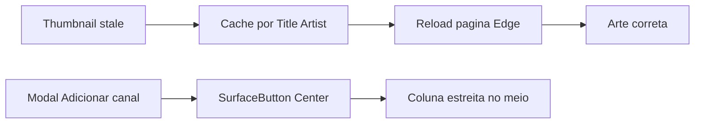
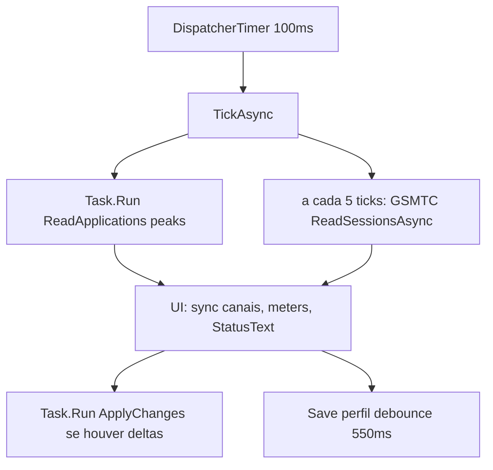
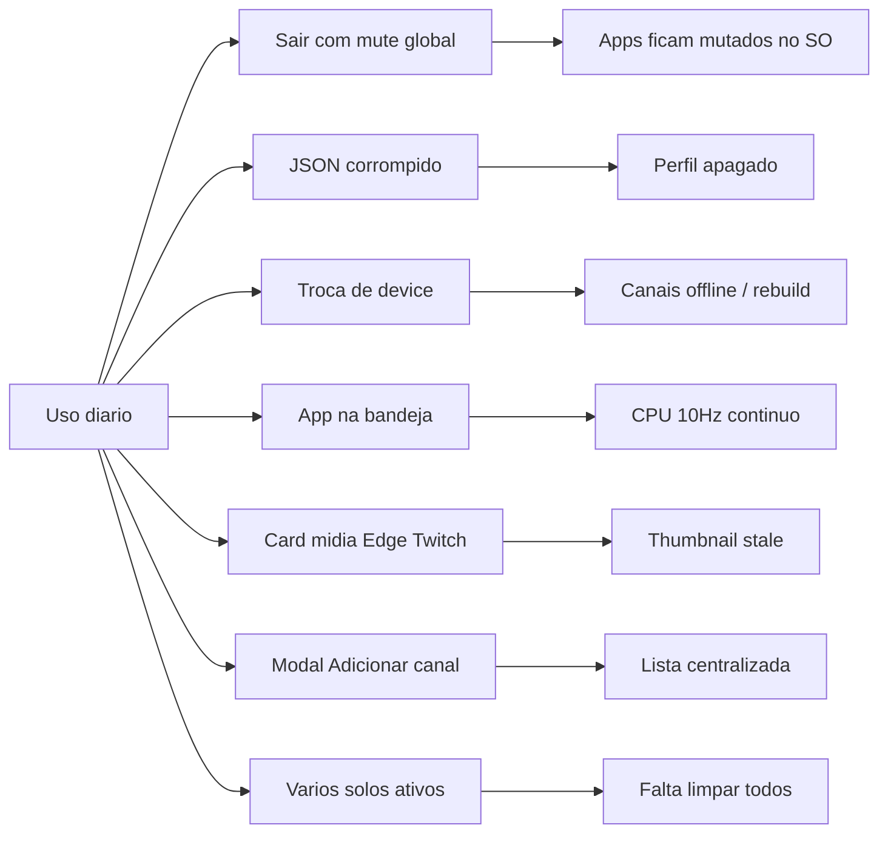

# Avaliação: performance, bugs e melhorias (MVP)

**Escopo:** somente avaliação — sem alteração de código do app.  
**Base:** código + screenshots do usuário em [`reports/`](c:/Antigravity/molecular/reports/) + [`ROADMAP.md`](ROADMAP.md).

**Veredicto:** usável, mas **não pronto para validação diária oficial**. Críticos: perfil corrompido e mute residual. Evidências reais: thumbnail de mídia pode ficar errada até refresh da página; modal “Adicionar canal” com lista centralizada de forma não convencional; falta favoritar canal expandido e limpar todos os solos de uma vez.

---

## Casos observados (evidência 30/07/2026)

Screenshots em [`reports/`](c:/Antigravity/molecular/reports/):

| Foto | Conteúdo |
|------|----------|
| [caso-edge-twitch-windows-gsm-tc.png](c:/Antigravity/molecular/reports/caso-edge-twitch-windows-gsm-tc.png) | Flyout GSMTC do Windows: Edge + live Twitch (`alanzoka`) |
| [caso-edge-twitch-molecular-canal.png](c:/Antigravity/molecular/reports/caso-edge-twitch-molecular-canal.png) | Canal expandido Molecular (`msedge.exe`): mídia/controles; thumbnail chegou correta só após recarregar a página |
| [caso-adicionar-canal-lista-centralizada.png](c:/Antigravity/molecular/reports/caso-adicionar-canal-lista-centralizada.png) | Modal **ADICIONAR CANAL**: itens (Sons do sistema, Svchost, TextInputHost) agrupados ao **centro**, com laterais vazias |

### Caso 1 — Thumbnail de mídia divergente (relato do usuário)

**Problema real das fotos Edge/Twitch:** a **thumbnail** no Molecular ficou **diferente** da arte correta; após **recarregar a página** (fonte no Edge), o ícone/arte passou a bater.

Causa provável no código ([`WindowsMediaSessionService`](src/Molecular.App/Media/WindowsMediaSessionService.cs) ~51–57): cache `_thumbnailCache` chaveado só por `SourceAppId + Title + Artist`. Se o Windows/Edge publicar arte placeholder ou stale com o mesmo título/artista, o Molecular **congela** esses bytes até a chave mudar. Recarregar a página reinicia a sessão GSMTC e força nova leitura.

**Severidade:** médio (UX; auto-corrige com refresh externo).  
**Melhoria:** invalidar/atualizar thumbnail quando o stream GSMTC mudar (hash/tamanho dos bytes, ou TTL / re-fetch periódico); não cachear indefinidamente só por título.

Observações secundárias no mesmo card (ainda válidas):

- Título truncado demais (`FontSize=36` + `MaxHeight=80` em [`MainWindow.xaml`](src/Molecular.App/MainWindow.xaml) ~728–730).
- “INFORMAÇÕES DO CANAL” sem conteúdo (~771).
- Volume sessão (14%) ≠ volume mestre do SO (~80–90%) — esperado, não bug.

### Caso 2 — Lista “Adicionar canal” centralizada

Evidência: [caso-adicionar-canal-lista-centralizada.png](c:/Antigravity/molecular/reports/caso-adicionar-canal-lista-centralizada.png).

O botão do item usa `HorizontalContentAlignment="Stretch"`, mas o estilo `SurfaceButton` fixa o `ContentPresenter` em `HorizontalAlignment="Center"` ([`MainWindow.xaml`](src/Molecular.App/MainWindow.xaml) ~131). O grid do item encolhe ao conteúdo e fica **centralizado** no modal (~380 px), deixando faixas vazias à esquerda/direita — layout não convencional.

**Severidade:** médio (UX óbvio).  
**Melhoria:** `ContentPresenter` com `HorizontalAlignment="{TemplateBinding HorizontalContentAlignment}"` (e vertical idem), ou estilo dedicado ao picker com stretch/left align.

---

## Arquitetura do loop (contexto)

- Áudio em estado estável: callbacks de sessão + poll de **pico** (~10 Hz) — bom desenho.
- Timer **continua** com a janela escondida na bandeja → custo idle permanente.

---

## Performance

### Hotspots reais (prioridade)

| Pri | Achado | Onde | Impacto |
|-----|--------|------|---------|
| Alta | GSMTC a cada ~500 ms no contexto UI; `SyncMedia` dispara muitos `PropertyChanged` mesmo sem mudança | [`MainViewModel`](src/Molecular.App/ViewModels/MainViewModel.cs) ~214–220; `ChannelViewModel.SyncMedia` | CPU/UI com Spotify etc. |
| Alta | `UpdateAudioActivity` / `StatusText` notifica a cada `Sync` (~10 Hz × canais) | `ChannelViewModel` | thrash de binding |
| Alta | Arrastar fader → `OnChannelChanged` → rebuild de opções de atribuição em **todos** os canais + save debounce | `MainViewModel` + XAML `UpdateSourceTrigger=PropertyChanged` | CPU durante drag |
| Média–Alta | `OnPropertyValueChanged` de dispositivo força rebuild total de sessões | [`WindowsAudioSessionService`](src/Molecular.Core/Audio/WindowsAudioSessionService.cs) ~478, 170–189 | flash offline, COM churn |
| Média | Loop 10 Hz ativo na bandeja | [`MainWindow.xaml.cs`](src/Molecular.App/MainWindow.xaml.cs) timer | bateria/idle |
| Média | Save JSON síncrono no dispatcher após debounce | [`ProfileStore.Save`](src/Molecular.Core/Persistence/ProfileStore.cs) | hitch leve ao soltar fader |
| Média | Snapshot `GroupBy`/`ToArray` + allocs a cada tick | audio service ~300–314 | piso de GC @ 10 Hz (ok em escala pequena) |

### Já razoável

- Ícones: cache estático + load em background.
- Sessões: tracking por callback; tick só lê peaks.
- Single-file: custo principal é **cold start** (sem R2R); não o tick.

### Melhorias de perf sugeridas (sem implementar)

1. Pausar ou reduzir tick (ex.: 1–2 Hz) com janela na bandeja; full rate só quando visível / áudio ativo.
2. Rodar GSMTC em `Task.Run`; notificar propriedades de mídia só se valores mudaram; throttle de progresso.
3. Em mudança de `TargetVolume`, salvar debounced **sem** `RefreshAssignmentOptions`.
4. Rebuild de sessões só em add/remove/default device — não em qualquer `PropertyValueChanged`.
5. (ROADMAP P1) intervalo de medidor configurável / idle adaptativo.

---

## Bugs (por severidade)

### Críticos

**1. Perfil corrompido é apagado silenciosamente**  
[`ProfileStore.Load`](src/Molecular.Core/Persistence/ProfileStore.cs) catch → `new MixerProfile()`; construtor do VM chama `Save()` → sobrescreve `profile.json`.  
**Repro:** JSON inválido → abrir Molecular → canais perdidos.  
**Já no ROADMAP:** P0.4 (backup + recuperação + aviso).

**2. Mute global / solo deixam apps mutados no Windows após sair**  
[`Dispose`](src/Molecular.App/ViewModels/MainViewModel.cs) ~319–329 salva e libera áudio, mas **não restaura** mutes aplicados às sessões do SO.  
**Repro:** Silenciar tudo → Sair pela bandeja → Spotify/Chrome permanecem mutados no Mixer do Windows.

### Altos

| # | Bug | Evidência |
|---|-----|-----------|
| 3 | Flag de rebuild zerada no fim de `EnsureSessionMonitor` pode descartar pedido concurrente | `Interlocked.Exchange(..., 0)` ~189 |
| 4 | Qualquer property change de device → teardown completo → 1 tick vazio → canais “offline” | `OnPropertyValueChanged` → rebuild |
| 5 | Identidade pode alternar `pid:N` ↔ `process:name` se `GetProcessById` falhar | `ResolveIdentity` — quebra binding do canal |
| 6 | Apps elevados: sem `MainModule` → sem ícone; matching de mídia mais frágil | catch vazio em MainModule |
| 7 | `_pendingMuteRestores` limpo antes de `ApplyChanges` completar; exit no meio do tick perde restore | Tick ~243–245, 306–307 |
| 8 | Solo **não** muta apps detectados sem canal (global mute sim) | Tick ~247–270 vs 293–300 |

### Médios

- **Thumbnail GSMTC stale** até refresh da página — cache por Title/Artist ([caso Molecular](c:/Antigravity/molecular/reports/caso-edge-twitch-molecular-canal.png) + relato; ver Caso 1).
- **Lista “Adicionar canal” centralizada** — `SurfaceButton` ignora stretch ([caso modal](c:/Antigravity/molecular/reports/caso-adicionar-canal-lista-centralizada.png); ver Caso 2).
- Título GSMTC truncado demais no card expandido ([caso Molecular](c:/Antigravity/molecular/reports/caso-edge-twitch-molecular-canal.png)).
- “INFORMAÇÕES DO CANAL” sem conteúdo (mesma evidência).
- Canais “zumbi” com `ApplicationKey` null após reatribuição duplicada.
- Match de mídia por substring + `FirstOrDefault` (neste caso Edge ok; risco permanece).
- Após sleep, `StepToward` com `elapsed` grande pode saltar volume.
- Troca de device limpa `_liveOnPreviousTick` → sessões tratadas como “novas”.
- `DispatcherUnhandledException` com `Handled = true` mantém processo inconsistente.
- Ícone da bandeja pode “fantasma” se o processo for morto sem `OnExit`.

### Baixos

- Confusão volume mestre vs volume de sessão — UX, não bug de API.
- `WindowsMediaSessionService` não disposed; `IconCache` cresce pela vida do processo.
- Muitos `catch` vazios — resiliência vs diagnóstico (ROADMAP P0.5).
- Migrações 4 e 5 redundantes no Normalize.
- `ChannelBinding.IsPinned` já existe no modelo ([`MixerProfile.cs`](src/Molecular.Core/Models/MixerProfile.cs) ~25) mas **não é usado** na UI/VM.

---

## Melhorias (priorizadas)

Alinhadas ao ROADMAP + feedback do usuário. **Não implementar agora** (só avaliação).

### P0 — desbloqueiam uso diário

1. Restaurar mutes do SO no shutdown / antes de `Dispose` do áudio (**bug #2**).
2. Backup + validação + aviso ao recuperar perfil (**bug #1** / ROADMAP P0.4).
3. Recuperação visível pós-suspend / device loss + backoff (ROADMAP P0.3).
4. Iniciar com o Windows (ROADMAP P0.2 restante).
5. Log operacional + exportar diagnóstico (ROADMAP P0.5).
6. Testes: perfil corrompido, device switch, mute-on-exit (ROADMAP P0.6 + gaps).

### P1 — qualidade / UX pedida pelo usuário

- **Favoritar / fixar canal expandido** (ex.: Spotify sempre expandido com pause / pular / voltar). Persistir via `IsPinned` (campo já no perfil) + `ViewMode=expanded`; “Colapsar todos” não deve derrubar pinned; restaurar pinned ao abrir o app.
- **Botão limpar / alternar isolamento (SOLO) em massa** — hoje o ToolTip do Solo é “Isolar canal”; limpar um a um é trabalhoso. Botão global (junto a “Colapsar todos” / painel): se há qualquer `IsSolo` no perfil → “Limpar solos”; senão (ou após limpar) → texto/estado conforme perfil salvo (ex. reaplicar solos salvos / “Restaurar isolamento”). Persistir no `profile.json`.
- Corrigir stretch do modal Adicionar canal (`ContentPresenter` com TemplateBinding).
- Invalidar/atualizar cache de thumbnail GSMTC (Caso 1).
- Throttle do tick na bandeja; intervalo de meters configurável.
- Persistir dispositivo de saída preferido.
- Settings reais (autostart, comportamento de fechar, meters).
- Assinatura Authenticode do portable.
- Estabilizar chave de identidade de processo.
- Solo consistente com apps não atribuídos (ou documentar).

### P2 — polish

- GSMTC off-UI + notify-if-changed; media matching mais estrito.
- Layout do card de mídia: título legível + ToolTip; preencher ou remover “INFORMAÇÕES DO CANAL”.
- Esclarecer volume de sessão vs volume do sistema.
- Split de `MainViewModel`; settings fora só do perfil de canais.
- ReadyToRun / build framework-dependent opcional.
- CI rodando `Molecular.Core.Tests`.
- Sincronizar versão hardcoded na UI com `csproj`.

---

## Mapa rápido: o que mais dói o usuário

---

## Conclusão

| Dimensão | Nota resumida |
|----------|----------------|
| Performance | Aceitável com poucos canais e janela aberta; **fraca em idle/bandeja e com mídia** |
| Bugs | **2 críticos** + thumbnail stale + modal centralizado (evidenciados) |
| Features pedidas | Favoritar/pin expandido (`IsPinned` já no modelo); botão limpar/alternar solos em massa |
| Melhorias | ROADMAP P0 + unmute no exit + throttle bandeja + UX mídia/picker/solo |
| Evidências | [`reports/`](c:/Antigravity/molecular/reports/) — 3 screenshots linkados acima |

Nenhuma alteração de código do app nesta etapa — apenas avaliação + evidências em `reports/`.
