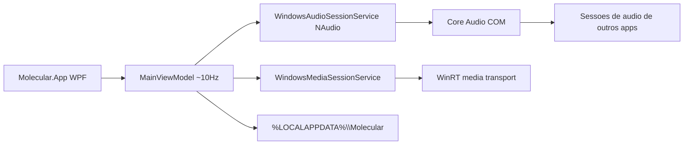

# Avaliação de segurança do MVP Molecular

**Escopo:** somente avaliação — sem alteração de código.  
**Produto:** mixer pessoal de áudio Windows (WPF + NAudio/WASAPI + GSMTC), v0.2.x.  
**Veredicto:** **baixo risco de ban/anticheat**; **sem falhas de segurança críticas** no código analisado. O maior risco prático para o usuário é **falso positivo de SmartScreen/AV** por build portátil não assinada, não comportamento malicioso.

---

## O que o MVP faz (superfície real)

- Controla volume/mute/solo via **Core Audio** (`SimpleAudioVolume`), mesma classe do Mixer de Volume do Windows.
- Identifica apps por PID da sessão + `Process.GetProcessById` / `MainModule.FileName` (nome + ícone).
- Lê metadados de mídia e envia play/pause/next via **GSMTC**.
- Persiste perfil/logs só em `%LOCALAPPDATA%\Molecular`.
- Roda como usuário atual: [`app.manifest`](src/Molecular.App/app.manifest) com `asInvoker` e `uiAccess="false"`.

---

## Checklist anticheat / antivirus / ban

| Área | Status no MVP | Implicação |
|------|---------------|------------|
| Injeção de DLL / `CreateRemoteThread` / memória remota | Ausente | Não parece cheat |
| Drivers kernel / BYOVD | Ausente | Sem sinal ring0 |
| Hooks de input (`SetWindowsHookEx`, `SendInput`) | Ausente | Sem automação de mouse/teclado |
| Overlay DirectX/Vulkan no processo do jogo | Ausente | Sem overlay invasivo |
| Scan de memória / patterns | Ausente | Sem tooling de cheat |
| Evasão de AV / obfuscação / packer | Ausente | Publish .NET single-file normal |
| Elevação admin / `SeDebugPrivilege` | Ausente (`asInvoker`) | Bom |
| Rede / telemetria / exfiltração | Ausente no runtime | Bom para privacidade |
| Escrita em pastas de jogos | Ausente | Só AppData local |
| Autostart / persistência de boot | Ausente (só bandeja enquanto roda) | Bom |

**Conclusão anticheat:** comportamento alinhado a apps como Mixer do Windows, Discord, Voicemeeter — controla áudio pelo SO, **sem entrar no processo do jogo**. Anticheats (EAC, BattlEye, Vanguard, etc.) focam injeção, memória, drivers e input; esse MVP não implementa esses vetores.

**Ressalva honesta:** nenhum app de terceiros pode garantir “nunca será banido” (políticas de jogo/AC variam e mudam). Com o código atual, o risco de ban **por comportamento de cheat** é **muito baixo**. O risco residual é heurística genérica (processo desconhecido + enumeração de PID), típica de mixers e raramente motivo de ban por si só.

---

## Achados por severidade

### Nenhum / não aplicável (padrões de malware-cheat)
- Sem `OpenProcess`/`ReadProcessMemory`/`WriteProcessMemory`/`VirtualAllocEx`.
- Sem hooks de API de jogo; o único “hook” é `HwndSource.AddHook` em [`MainWindow.xaml.cs`](src/Molecular.App/MainWindow.xaml.cs) para `WM_GETMINMAXINFO` (maximizar janela).
- `SetOverlayImage` em [`AudioApplicationViewModel.cs`](src/Molecular.App/ViewModels/AudioApplicationViewModel.cs) é COM de ícones do shell, não overlay de jogo.
- `SafetyEngine` em [`SafetyEngine.cs`](src/Molecular.Core/Safety/SafetyEngine.cs) é teto de volume, não mitigação de exploit.

### Médio — confiança de distribuição (AV / SmartScreen)
- Publish portátil self-contained single-file ([`Portable-win-x64.pubxml`](src/Molecular.App/Properties/PublishProfiles/Portable-win-x64.pubxml), [`publish-portable.ps1`](scripts/publish-portable.ps1)) **sem Authenticode**.
- EXE grande com runtime .NET embutido costuma gerar alerta “publisher desconhecido” / falso positivo heurístico — **não é evasão**, mas pode incomodar o usuário.
- Mitigação futura (fora deste escopo de avaliação): assinar o binário; opcionalmente publicar framework-dependent.

### Médio (por design) — controle de áudio de outros apps
- [`WindowsAudioSessionService.ApplyChanges`](src/Molecular.Core/Audio/WindowsAudioSessionService.cs) altera volume/mute de sessões de outros processos via WASAPI.
- Inclui jogos se tiverem sessão de áudio; mute global / solo / teto de novas sessões em [`MainViewModel`](src/Molecular.App/ViewModels/MainViewModel.cs).
- Isso **não injeta** no jogo; é API oficial do Windows. Risco de ban por isso: **desprezível** em ACs mainstream. Risco de UX: silenciar áudio de jogo/chat se o usuário (ou perfil corrompido) pedir.

### Baixo — privacidade local
- GSMTC lê título/artista/thumbnails em memória ([`WindowsMediaSessionService.cs`](src/Molecular.App/Media/WindowsMediaSessionService.cs)); README afirma que títulos **não** vão para logs de crash.
- Perfil pode guardar `ExecutablePath` de apps (metadado para UI), só em AppData.
- Crash logs usam `exception.ToString()` — podem conter paths do ambiente, não mídia.

### Baixo — superfície local (mesmo usuário)
- Qualquer código no mesmo usuário pode ler/alterar `profile.json` e, indiretamente, afetar volumes na próxima execução do Molecular.
- Não há rede; não há elevação; ameaça remota via o app em si é essencialmente nula no estado atual.

---

## Dependências e P/Invoke

- Única dependência de terceiros relevante: **NAudio 2.3.0** (wrappers COM Core Audio).
- P/Invoke limitado a: monitores (`MonitorFromWindow`/`GetMonitorInfo`), ícones shell (`PrivateExtractIcons`, `SHGetFileInfo`, `SHGetImageList`).
- Sem FFI customizado, sem C++/Rust, sem `.sys`.

---

## O que *não* é falha de segurança do usuário/jogo

- Mutar/baixar volume de um jogo via mixer **não** é exploit nem anticheat bypass.
- Listar PID de sessões de áudio **não** é acesso à memória do jogo.
- Controles de mídia GSMTC **não** são injeção de input no jogo.

---

## Resumo executivo

1. **Ban / anticheat:** código atual **não** implementa vetores típicos de ban; risco de ban por “cheat” é **muito baixo**.
2. **Antivirus:** sem malware patterns; risco principal = **falso positivo / SmartScreen** por EXE não assinado self-contained.
3. **Segurança do usuário:** sem exfiltração, sem elevação, sem persistência oculta; capacidade sensível é a do próprio mixer (volume/mute) + metadados de mídia locais.
4. **Nenhuma correção de código** é necessária para “não parecer cheat”; melhorias futuras de confiança seriam signing e comunicação clara do que o app faz (fora desta avaliação).
